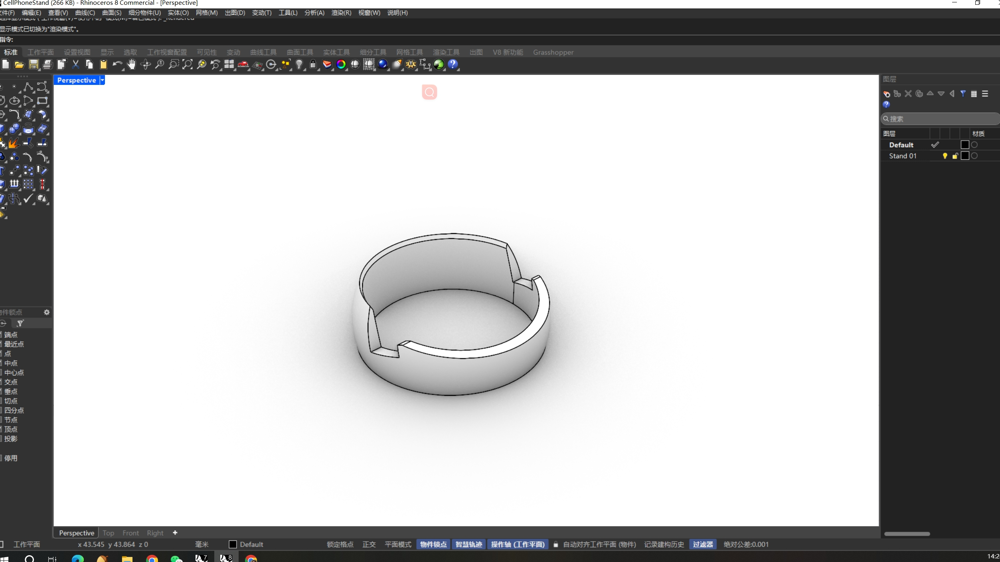
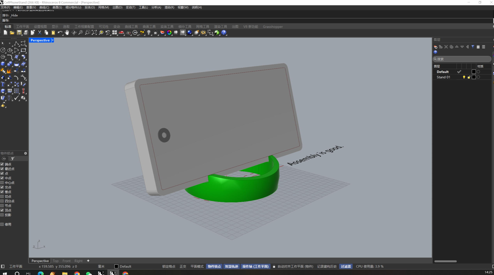

# Hello DES INV 202 Student!
Welcome to your new GitHub repository! 

# Outline
[week 1 example](README.md#week-1-example-report-1)

[week 1](README.md#week-1-report)

---

# Github Background Information & Context
If you’re new to GitHub, you can think of this as a shared file space (like a Google Drive folder, or a like a USB drive that’s hosted online.) 

This is your space to store project files, videos, PDFs, notes, images, etc., and (hopefully, neatly) organize so it's easy for viewers (and you!) to navigate. That said, it’s super easy for you to share any file or folder with us (your TDF instructional team) - just send us the link!  As a start, feel free to simply add images to the `/assets` folder, which is located [here](/assets). 

The specific file that I’m typing into right now is the **README.md** for this repo. 
##### (💡 TIP: The .md indicates that we’re using [Markdown formatting.](https://www.markdownguide.org/cheat-sheet/)) #####
<h6> (💡 TIP 2: GitHub Markdown supports <a href="https://gist.github.com/seanh/13a93686bf4c2cb16e658b3cf96807f2"> <em>HTML formatting</em> too, including emojis 😄</a>, in case that helps!) </h6>

### :star: Whatever you write in your **README.md** will show up on the “front page” of your GitHub repo. This is where we’ll be looking for your [weekly progress reports](https://github.com/Berkeley-MDes/24f-desinv-202/wiki/3.0-Weekly-Submissions#weekly-progress-report). They might look something like this: ###

# Week 1: Example Report 1 #
## Week of 09/05/2024

This week, I designed a cool phone stand made of rocks. Check out all my cool sketches and progress photos from this week below, etc., etc....

---

It's time to start making this space your own! If you want to save these instructions, make a copy.  Also, feel empowered to delete everything in this README.md and start documenting! 

Excited to work with you,
your TDF teaching team

PS: let us know if you have any questions!!

PPS: 

## Quick Links, compiled here for your convenience: ##

- [TDF Wiki](https://github.com/Berkeley-MDes/24f-desinv-202/wiki) - the ultimate source for truth and information about the course and assignments
- [Google Drive Folder](https://drive.google.com/drive/u/0/folders/1DJ1b6sSDwHXX6NRcQYt10ivyQSgU0ND6) - slides and other resources
- [bCourses](https://bcourses.berkeley.edu/courses/1537533) - where the grading happens

# Week 1: Report #
## Week of 08/29/2024

This week, I have learned how to edit and use the file on github.

Besides, I have installed Rhino and opend the file on Google Drive successfully

---

# Week 2: Report #
## Week of 09/12/2024

This week, 

1.Make diagrams of the example files shared

2.Experiment with the files shared, manipulate the parameters and ‘bake’ some forms and generating your own basic model of a form using Grasshopper.

 

---

# Week 3: Report #
## Week of 09/18/2024

 During the modification process, I also experimented with Perlin noise to add randomness to the data, and used genetic algorithms to find the minimal volume solution within a certain range. However, during these attempts, I discovered that the random function component in Grasshopper does not produce true randomness. Strictly speaking, it’s not a real random number, as the data generated is the same for each seed value. This led me to wonder whether it’s possible to achieve truly random numbers. So, I decided to integrate all the form components using Python code.

Although I had some prior experience with Grasshopper, this was my first attempt at such a project. The code in the image simplifies the original complex setup into a single Python component, ensuring absolute randomness in the data every time it runs. The logic in Python mirrors that in Grasshopper; I wrote functions in Python to generate cubes, select random points, create spheres with random radii, and perform Boolean operations between cubes and rectangular prisms. Of course, I also received some help from ChatGPT during this process.

There are clearer videos on YouTube.:[https://youtu.be/Jvf5CLIVpYE](https://github.com/Berkeley-MDes/tdf-fa24-dingchuhua/edit/main/README.md)

<video width="500" alt="Week2 02" src="assets/TDF Project01YS">

---

