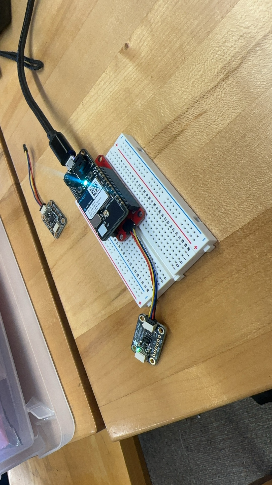

# Hello DES INV 202 Student!
Welcome to your new GitHub repository! 

# Outline
[week 1 example](README.md#week-1-example-report-1)

[week 1](README.md#week-1-report)

[week 2](README.md#week-2-report)

[week 3](README.md#week-3-report)

[week 4](README.md#week-4-report)

[week 5 01](README.md#week-5-report-01)

[week 5 02](README.md#week-5-report-02)

[week 6 01](README.md#week-6-report-01)

[week 6 02](README.md#week-6-report-02)

[week 7](README.md#week-7-report)

[week 8](README.md#week-8-report)

[week 9](README.md#week-9-report)

[week 10](README.md#week-10-report)

---

# Github Background Information & Context
If you’re new to GitHub, you can think of this as a shared file space (like a Google Drive folder, or a like a USB drive that’s hosted online.) 

This is your space to store project files, videos, PDFs, notes, images, etc., and (hopefully, neatly) organize so it's easy for viewers (and you!) to navigate. That said, it’s super easy for you to share any file or folder with us (your TDF instructional team) - just send us the link!  As a start, feel free to simply add images to the `/assets` folder, which is located [here](/assets). 

The specific file that I’m typing into right now is the **README.md** for this repo. 
##### (💡 TIP: The .md indicates that we’re using [Markdown formatting.](https://www.markdownguide.org/cheat-sheet/)) #####
<h6> (💡 TIP 2: GitHub Markdown supports <a href="https://gist.github.com/seanh/13a93686bf4c2cb16e658b3cf96807f2"> <em>HTML formatting</em> too, including emojis 😄</a>, in case that helps!) </h6>

### :star: Whatever you write in your **README.md** will show up on the “front page” of your GitHub repo. This is where we’ll be looking for your [weekly progress reports](https://github.com/Berkeley-MDes/24f-desinv-202/wiki/3.0-Weekly-Submissions#weekly-progress-report). They might look something like this: ###

# Week 1: Example Report 1 #
## Week of 09/05/2024

This week, I designed a cool phone stand made of rocks. Check out all my cool sketches and progress photos from this week below, etc., etc....

---

It's time to start making this space your own! If you want to save these instructions, make a copy.  Also, feel empowered to delete everything in this README.md and start documenting! 

Excited to work with you,
your TDF teaching team

PS: let us know if you have any questions!!

PPS: 

## Quick Links, compiled here for your convenience: ##

- [TDF Wiki](https://github.com/Berkeley-MDes/24f-desinv-202/wiki) - the ultimate source for truth and information about the course and assignments
- [Google Drive Folder](https://drive.google.com/drive/u/0/folders/1DJ1b6sSDwHXX6NRcQYt10ivyQSgU0ND6) - slides and other resources
- [bCourses](https://bcourses.berkeley.edu/courses/1537533) - where the grading happens

# Week 1: Report #
## Week of 08/29/2024

This week, I have learned how to edit and use the file on github.

Besides, I have installed Rhino and opend the file on Google Drive successfully

---

# Week 2: Report #
## Week of 09/12/2024

This week, 

1.Make diagrams of the example files shared

2.Experiment with the files shared, manipulate the parameters and ‘bake’ some forms and generating your own basic model of a form using Grasshopper.

 

---

# Week 3: Report #
## Week of 09/19/2024

 During the modification process, I also experimented with Perlin noise to add randomness to the data, and used genetic algorithms to find the minimal volume solution within a certain range. However, during these attempts, I discovered that the random function component in Grasshopper does not produce true randomness. Strictly speaking, it’s not a real random number, as the data generated is the same for each seed value. This led me to wonder whether it’s possible to achieve truly random numbers. So, I decided to integrate all the form components using Python code.

Although I had some prior experience with Grasshopper, this was my first attempt at such a project. The code in the image simplifies the original complex setup into a single Python component, ensuring absolute randomness in the data every time it runs. The logic in Python mirrors that in Grasshopper; I wrote functions in Python to generate cubes, select random points, create spheres with random radii, and perform Boolean operations between cubes and rectangular prisms. Of course, I also received some help from ChatGPT during this process.

There are clearer videos on YouTube.: https://www.youtube.com/watch?v=DnZai46PktM
<video width="500" alt="Week2 02" src="assets/TDF Project01YS">

---

# Week 4: Report #
## Week of 09/26/2024

This week I have learned some knowledge about photon2 and successfully intalled the IDE. Beseides, I have drawn the concept map of the Interaction Ecosystems of Apple watch, illustrating how its running function works.  
 

---

# Week 5: Report 01 #
## Week of 09/30/2024

I have tried and flashed three scripts at home.They are: 01 serial port display showing 'hello world' separately; 02 strobe light; 03 using an ultrasonic sensor to measure distance and trigger the light.

In script 01, I changed the interval at which each letter appears.

 

In script 02, I added led lights to the board and set the interval for the lights to blink to 1 second.

  

In script 03, I introduced an ultrasonic sensor into the circuit to set the light bulb to light up when the object got close enough.

  

I think the operation is very similar to arduino. photon2 is like the brain of the entire system and is controlled by code, the wires and breadboards are like the blood in the system, and the various sensors and light bulbs are like organs.

What I think is missing in life is an ecosystem based on stable feedback, and ecosystems in life are generally more fragile.

Failure and experience: Because I am not familiar with the IDE environment, I created two cpp files at the beginning, resulting in the inability to burn the code into the MCU, and I am not familiar enough with the C language code, or I need to learn more in the future

---

# Week 5: Report 02 #
## Week of 10/03/2024

   

 

 

Differance: They have used more complex componet.

Similarity: They all based on the same logic: the sensor get the feedback and the whole system reflects the feedback like light flashing

Feature: The system will respond to the stimulus, which would be very useful in our daily lives.

 Machine Learning could improve the wany and accurancy the whole system reacts.

 I think many differant sensors and script logic could be intergrated into one system, making it respond to many kinds of stimulus.

 ---

# Week 6: Report 01 #
## Week of 10/07/2024

I opened two files but they both have problems. And I have tried to reinstalled the library, it still have errors. I am still trying to work it out.

 

 

---

# Week 6: Report 02 #
## Week of 10/10/2024

I have started a team named Fuller with my classmate and completed the project proposal.

 

---

# Week 7: Report #
## Week of 10/17/2024
Along with my teammate Qin Tian, we have accomplished most experiments in the proposal, such as LED Light; Ambient Light Sensor; STEMMA QT-based sensors and so on

  
  

---

# Week 8: Report #
## Week of 10/24/2024
Along with my teammate Qin Tian, we have finished our project.
 
 
 

---

# Week 9: Report #
## Week of 10/31/2024
This week I have learnt how to build a LLM agent based on zerowidth and watched the whole tutorial posetd by TJ
 
 

---

# Week 10: Report #
## Week of 11/07/2024
This week I have successfully built my database and make the GPT answer my questions correctly. 

Besides, I have finished the project report and presentation vedio.
 
 

